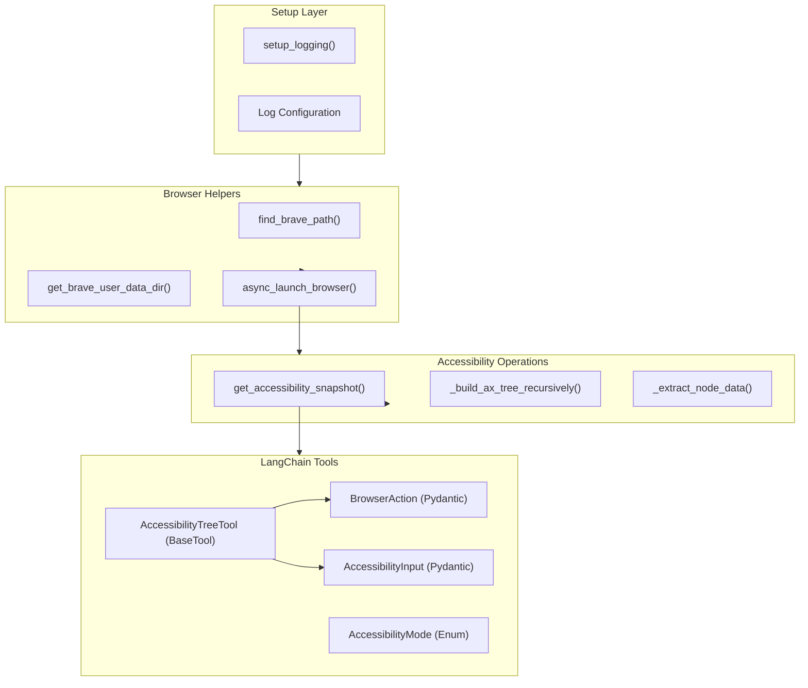
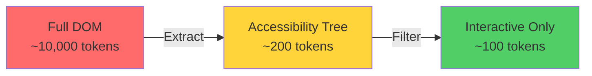
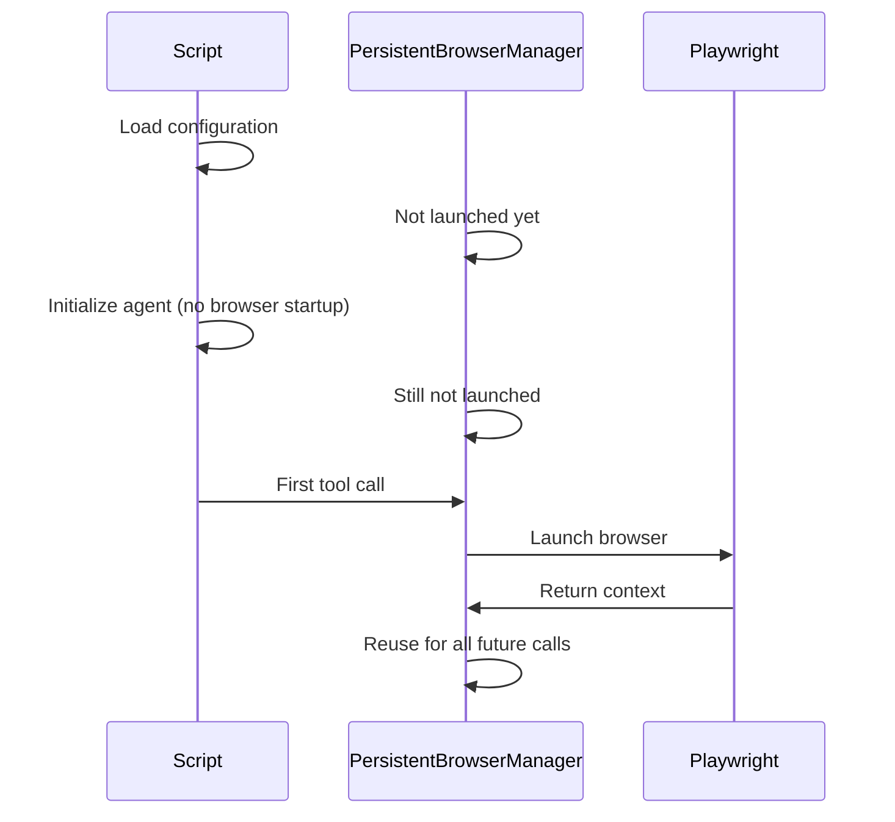
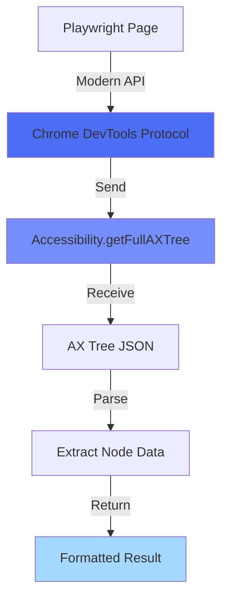
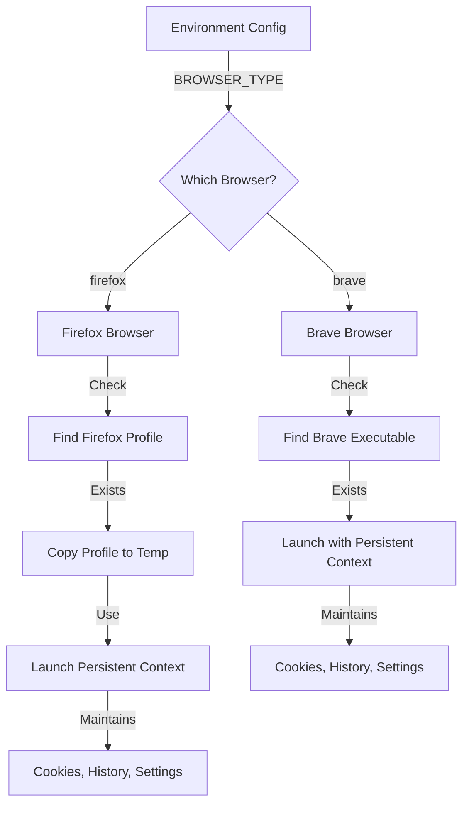
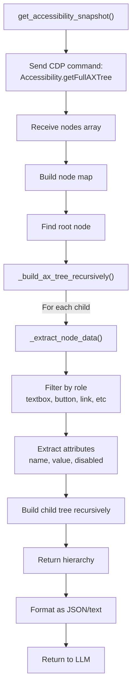
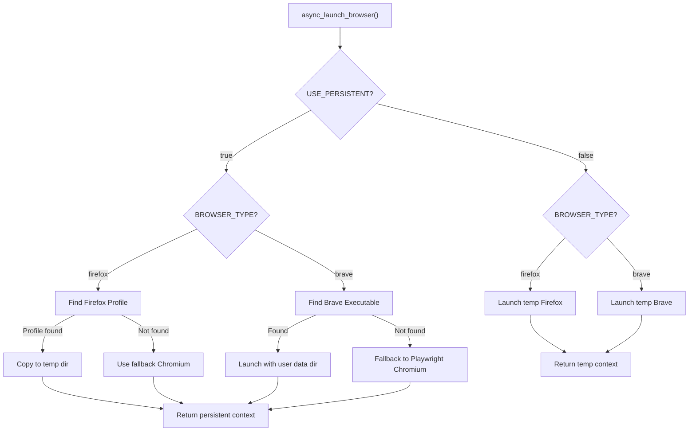
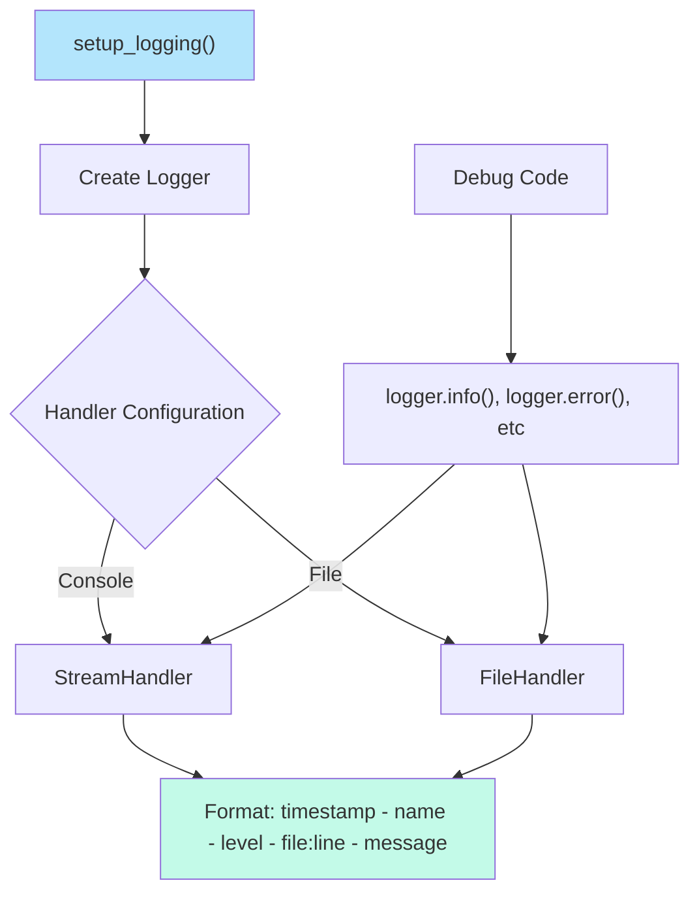
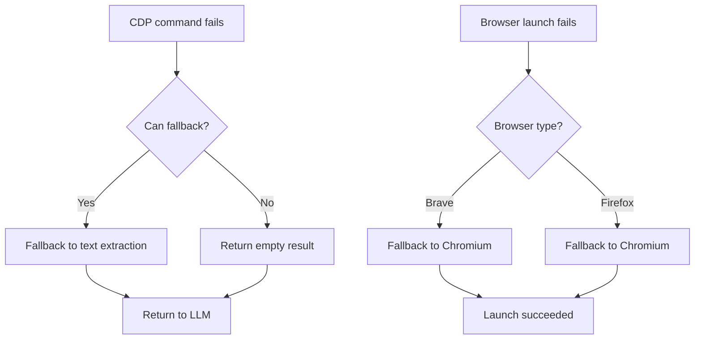

# accessibility_tree.py - Token-Efficient Web Navigation

## Overview

`accessibility_tree.py` implements token-efficient web navigation strategies specifically designed to reduce LLM token usage. It provides helper utilities for browser management, accessibility tree extraction, and Chrome DevTools Protocol (CDP) integration.

## Key Components Flow



## 5 Token-Efficient Strategies

### Strategy 1: Accessibility Tree Instead of Full DOM



**Why**: Accessibility trees contain only semantically important elements
- Remove boilerplate HTML
- Keep structured information
- Reduce redundancy

### Strategy 2: Lazy Browser Launch



**Benefit**: Browser only starts when needed, saves resources and time

### Strategy 3: CDP (Chrome DevTools Protocol) for Accessibility



**Advantage**: Replaces deprecated `page.accessibility.snapshot()`

### Strategy 4: Profile-Based Browser Context



### Strategy 5: Structured Output Formats

**Instead of raw HTML → Structured JSON**

```json
{
  "type": "accessibility_tree",
  "mode": "interactive",
  "nodes": [
    {
      "role": "button",
      "name": "Search",
      "selector": "button[type='submit']",
      "actions": ["click", "focus"]
    },
    {
      "role": "textbox",
      "name": "Search Query",
      "selector": "input[type='text']",
      "actions": ["type", "clear"]
    }
  ]
}
```

## Accessibility Tree Construction Flow



## Browser Launch Decision Tree



## Logging Architecture



## Pydantic Models for Type Safety

```python
# BrowserAction: Represents a browser action
class BrowserAction(BaseModel):
    action: str  # "click", "type", "scroll", etc
    selector: str  # CSS selector
    value: Optional[str]  # For type action

# AccessibilityMode: Enum for filtering level
class AccessibilityMode(str, Enum):
    INTERACTIVE = "interactive"  # Only clickable elements
    ALL = "all"  # Full tree

# AccessibilityInput: Tool input validation
class AccessibilityInput(BaseModel):
    mode: AccessibilityMode

# AccessibilityTreeTool: LangChain BaseTool implementation
class AccessibilityTreeTool(BaseTool):
    name: str = "accessibility_tree"
    description: str = "Get page structure for navigation"
```

## Code Organization

```
accessibility_tree.py
├── Imports (logging, asyncio, Playwright, Pydantic)
├── setup_logging()
├── find_brave_path()
├── get_brave_user_data_dir()
├── async_launch_browser()
│   ├── Firefox persistent context logic
│   ├── Firefox non-persistent logic
│   ├── Brave persistent context logic
│   └── Brave non-persistent logic
├── get_accessibility_snapshot()
│   ├── CDP command execution
│   ├── Node map building
│   └── Tree hierarchy construction
├── _build_ax_tree_recursively()
│   └── Recursive tree building
├── _extract_node_data()
│   ├── Filter by role
│   ├── Extract attributes
│   └── Collect actions
├── BrowserAction (Pydantic Model)
├── AccessibilityMode (Enum)
├── AccessibilityInput (Pydantic Model)
└── AccessibilityTreeTool (BaseTool)
```

## Token Reduction Examples

### Example 1: Button Discovery

**Without optimization** (Full DOM):
```html
<div class="navbar">
  <nav class="nav-links">
    <div class="nav-item">
      <button class="btn-primary" onclick="search()">Search</button>
    </div>
  </nav>
</div>
<!-- ... 50 more lines ... -->
Tokens: ~500
```

**With optimization** (Accessibility Tree):
```json
{
  "role": "button",
  "name": "Search",
  "selector": "button.btn-primary"
}
Tokens: ~20
```

**Savings: 96%** ✅

### Example 2: Form Field Discovery

**Without optimization**:
- Full form HTML with all styling, nested divs
- ~2000 tokens

**With optimization**:
```json
{
  "fields": [
    {"role": "textbox", "name": "Email", "selector": "input[name='email']"},
    {"role": "textbox", "name": "Password", "selector": "input[type='password']"},
    {"role": "button", "name": "Login", "selector": "button[type='submit']"}
  ]
}
```
- ~100 tokens

**Savings: 95%** ✅

## Reasoning Behind Design Choices

1. **CDP Integration**: Most reliable way to get accessibility tree in modern Playwright
2. **Lazy Initialization**: Don't launch browser until first navigation tool call
3. **Profile Copying**: Allows persistent state without leaving browser open
4. **Pydantic Models**: Type validation for tool inputs, reduces parsing errors
5. **Structured Output**: Consistent format for LLM parsing
6. **Multiple Modes**: Interactive mode for UI automation, All mode for comprehensive analysis
7. **Graceful Fallbacks**: Works even if Brave/Firefox not found

## Performance Considerations

| Operation | Time | Token Impact |
|-----------|------|--------------|
| Browser launch | 2-5s | N/A (one-time) |
| Get accessibility snapshot | <1s | 100-300 tokens |
| Get full page text | <1s | 500-3000 tokens |
| Build tree hierarchy | <1s | Included in snapshot |

## Error Recovery


