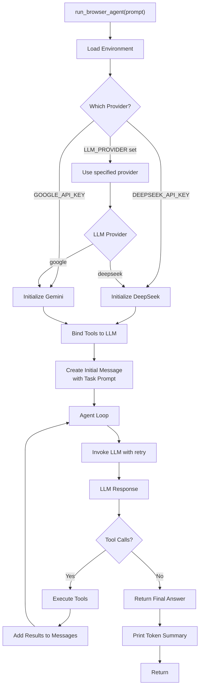
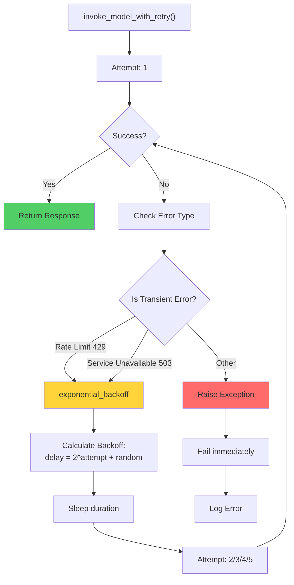
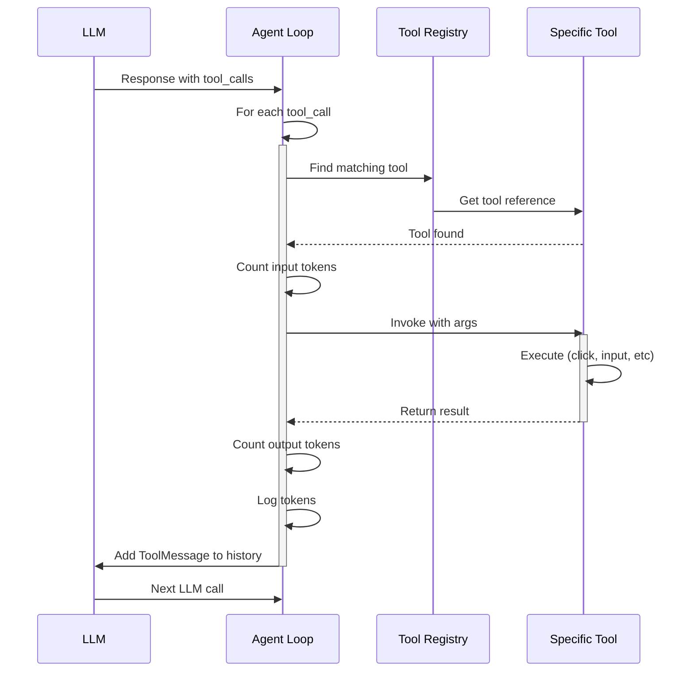
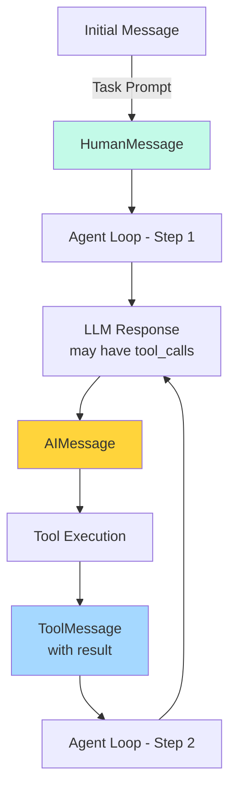
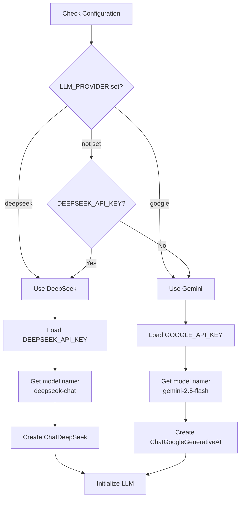
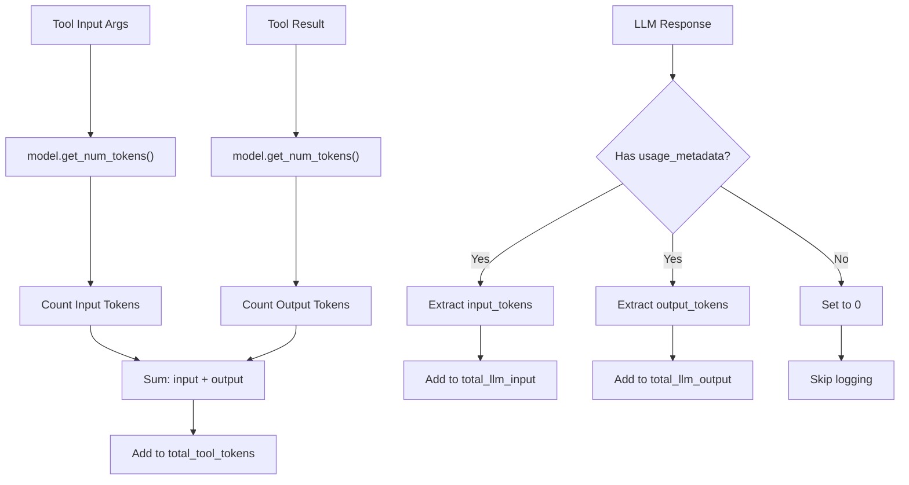
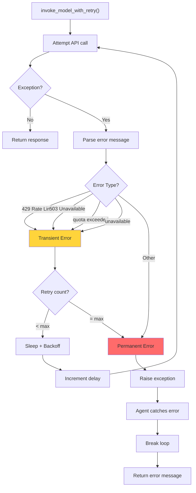
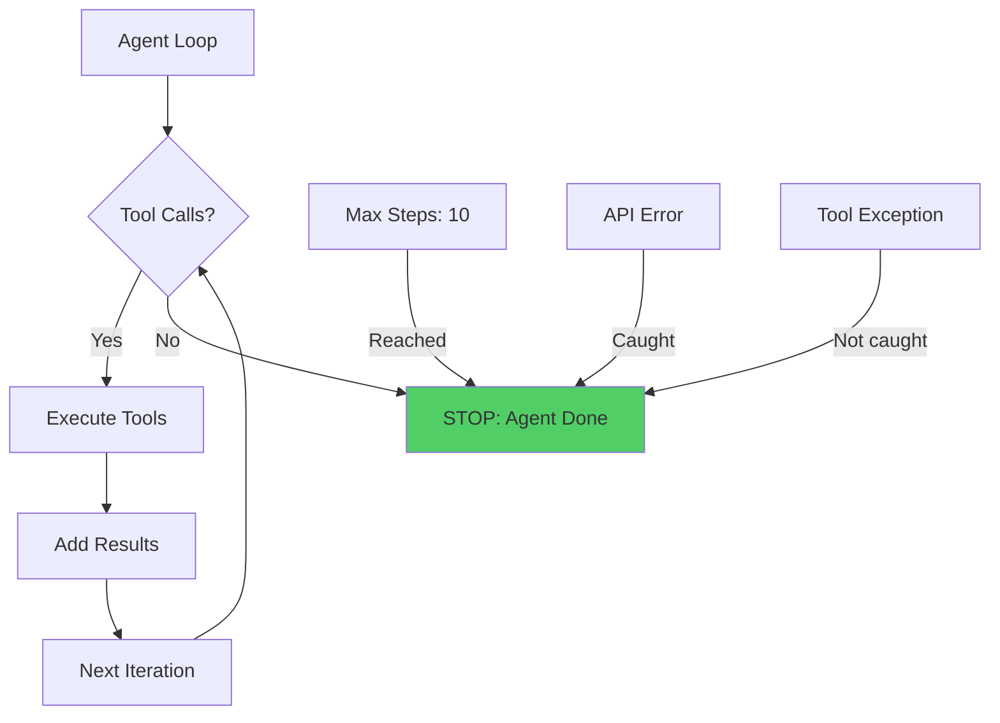

# agent_demo.py - Main Agent Loop

## Overview

`agent_demo.py` implements the core agent execution loop. It orchestrates the interaction between an LLM (Gemini or DeepSeek) and browser automation tools, handling retries, token tracking, and step-by-step task execution.

## High-Level Agent Flow



## Retry Logic Flow



## Tool Execution Loop



## Token Tracking Architecture

```mermaid
graph TB
    subgraph Tracking["Token Tracking"]
        LLMTokens["LLM Tokens"]
        ToolTokens["Tool Tokens"]
        TotalTokens["Total Tokens"]
    end
    
    subgraph Logging["Logging]
        LLMLog["LLM Token Log"]
        ToolLog["Tool Token Log"]
    end
    
    subgraph Reporting["Summary Report"]
        Report["Total Tokens Consumed"]
        Breakdown["Cost Breakdown by Component"]
    end
    
    LLMTokens --> |input + output| LLMLog
    ToolTokens --> |input + output| ToolLog
    LLMLog --> TotalTokens
    ToolLog --> TotalTokens
    TotalTokens --> Report
    LLMLog --> Breakdown
    ToolLog --> Breakdown
```

## Message History Structure



## LLM Provider Configuration



## Code Structure

```
agent_demo.py
├── Imports
├── invoke_model_with_retry()
│   ├── Loop: max_retries times
│   ├── Try: Call model.invoke()
│   ├── Catch: Check error type
│   ├── If transient: exponential backoff
│   └── Return response or raise
├── run_browser_agent(prompt)
│   ├── Load .env
│   ├── Determine LLM provider
│   ├── Initialize LLM
│   ├── Import browser tools
│   ├── Create tool list
│   ├── Bind tools to LLM
│   ├── Create initial message
│   ├── Initialize tracking variables
│   ├── Agent loop (max 10 steps)
│   │   ├── Invoke LLM with retry
│   │   ├── Log LLM tokens
│   │   ├── Check for tool calls
│   │   ├── For each tool call:
│   │   │   ├── Count input tokens
│   │   │   ├── Execute tool
│   │   │   ├── Count output tokens
│   │   │   └── Log tool tokens
│   │   └── Add tool results to messages
│   ├── Print final answer
│   └── Print token summary
└── Main execution (if __name__ == "__main__")
```

## Token Counting Strategy



## Error Handling Flow



## Tool Binding and Calling

```python
# Tool binding creates callable versions
model_with_tools = model.bind_tools(tools)

# When LLM calls a tool, it returns:
response.tool_calls = [
    {
        "name": "tool_name",      # str
        "args": {...},            # dict
        "id": "call_123"          # str (for async tracking)
    },
    ...
]

# We then:
# 1. Find matching tool by name
# 2. Call tool.invoke(args)
# 3. Get result as string
# 4. Create ToolMessage with result and call id
# 5. Add to message history
# 6. LLM sees result and decides next action
```

## Agent Loop Termination Conditions



## Step-by-Step Execution Example

```
Step 1: LLM Input
  Task: "Search for Python jobs on Naukri"
  Tools: [open_website, search_naukri, get_page_text, ...]

Step 2: LLM Output
  Thought: "I need to search for Python jobs. Let me use search_naukri_via_url"
  Tool Call: search_naukri_via_url("Python Developer")

Step 3: Tool Execution
  Tool: search_naukri_via_url
  Input: {"job_title": "Python Developer"}
  Result: "Naukri search page loaded with 5000+ results"

Step 4: LLM Receives Result
  Sees: Tool result added to message history
  Thought: "Great! Now let me get the job details from the search results"
  Tool Call: naukri_job_fetch()

Step 5: Tool Execution
  Tool: naukri_job_fetch
  Result: JSON array of 10 job listings with title, company, salary

Step 6: LLM Receives Data
  Thought: "I have the job information. Let me provide final answer"
  No more tool calls

Step 7: Final Answer
  Returns complete list with formatting to user
```

## Reasoning Behind Design Choices

1. **Exponential Backoff**: Respects API rate limits, increases wait time each attempt
2. **Token Tracking**: Monitors cost per tool and per LLM call for optimization
3. **Retry Logic**: Handles transient failures without failing entire workflow
4. **Step Limit**: Prevents infinite loops (max 10 steps)
5. **Message History**: LLM sees full context of previous interactions
6. **Tool Binding**: Leverages LangChain's built-in tool calling mechanism
7. **Error Isolation**: Tool errors don't crash agent, LLM sees errors and adapts
8. **Provider Flexibility**: Supports multiple LLM providers (Gemini, DeepSeek)

## Token Efficiency Tips

1. **Early Tool Specialization**: Use `naukri_job_fetch()` instead of `get_page_text()` for job pages
2. **Accessibility Mode**: Request "interactive" accessibility tree instead of "all"
3. **Targeted Extraction**: Get specific form fields instead of full page text
4. **Batch Operations**: Perform multiple actions per tool call when possible
5. **Result Truncation**: `get_page_text()` returns max 3000 chars, not unlimited

## Integration Points

- **LangChain**: `BaseTool`, `HumanMessage`, `AIMessage`, `ToolMessage`
- **LLM APIs**: Gemini, DeepSeek (via LangChain integration)
- **Browser**: All tools from `browser_tools.py`
- **Accessibility**: Uses tools defined in `accessibility_tree.py`
- **Configuration**: Reads from `.env` file
