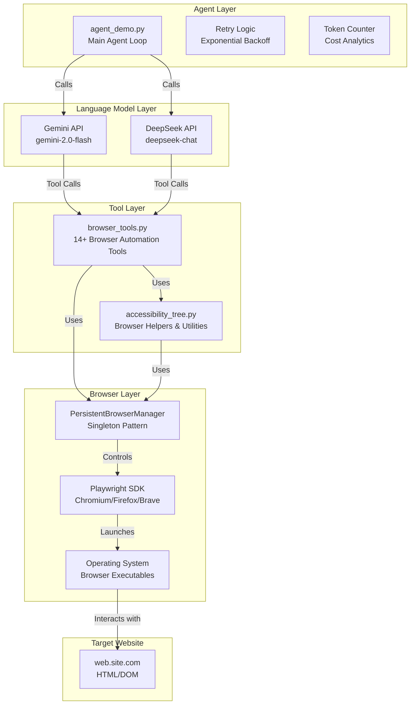
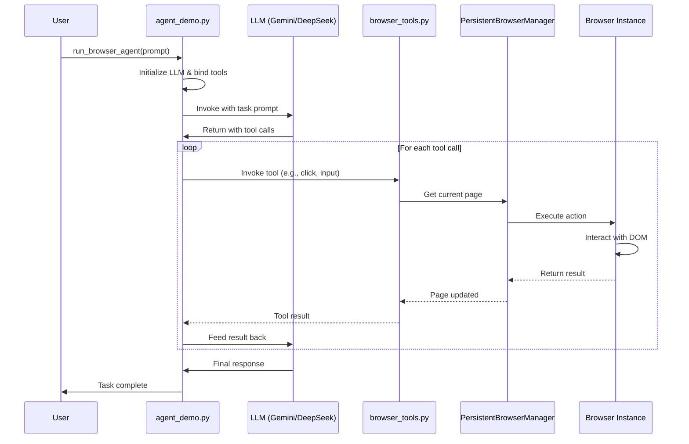
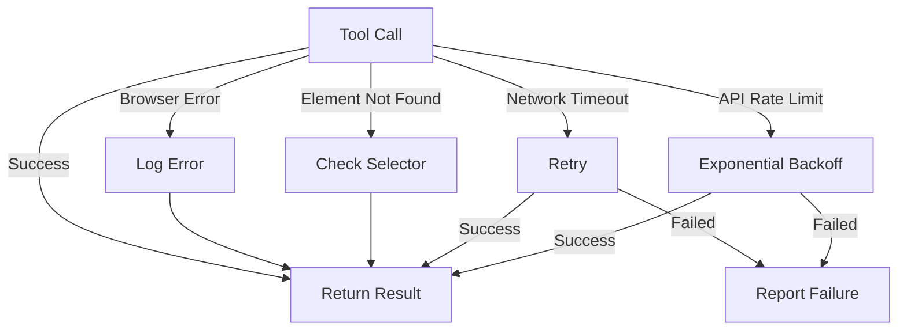

# Browser Agent Architecture

## System Overview

The browser agent is a multi-component system that automates web browser interactions using AI language models (Gemini or DeepSeek). It combines token-efficient navigation strategies with LangChain's tool-calling capabilities to accomplish complex web automation tasks.

## Component Diagram



## Data Flow Diagram



## Key Design Patterns

### 1. **Singleton Pattern** (PersistentBrowserManager)
- Ensures only one browser instance exists across the application
- Reuses browser context and page for all tool calls
- Reduces resource consumption

### 2. **Tool Provider Pattern** (LangChain)
- Browser tools are registered with the LLM
- LLM decides which tools to call based on task
- Enables autonomous decision-making

### 3. **Retry Strategy** (agent_demo.py)
- Exponential backoff for rate limiting (429, 503 errors)
- Graceful handling of transient failures
- Configurable retry attempts

### 4. **Accessibility-First Approach**
- Uses accessibility tree instead of full DOM
- Reduces token usage by 80%+
- More reliable element identification

## Execution Flow

```
1. Initialize Agent
   ├─ Load environment variables
   ├─ Initialize LLM (Gemini or DeepSeek)
   └─ Register browser tools
   
2. Agent Loop
   ├─ Send task + messages to LLM
   ├─ LLM decides: Continue or Call Tool
   │  ├─ If Continue: Return final answer
   │  └─ If Tool Call:
   │     ├─ Execute tool via browser
   │     ├─ Get tool result
   │     ├─ Add to message history
   │     └─ Loop back to LLM
   
3. Cleanup
   ├─ Keep browser open (per instructions)
   ├─ Print token usage summary
   └─ Return final response
```

## Environment Configuration

| Variable | Purpose | Default |
|----------|---------|---------|
| `GEMINI_API_KEY` / `GOOGLE_API_KEY` | Gemini authentication | None |
| `DEEPSEEK_API_KEY` | DeepSeek authentication | None |
| `LLM_PROVIDER` | Which LLM to use | `deepseek` (if available), else `google` |
| `BROWSER_TYPE` | Browser to launch | `brave` |
| `BROWSER_INCOGNITO` | Launch in private mode | `false` |
| `USE_PERSISTENT_CONTEXT` | Reuse browser profile | `true` |
| `BROWSER_HEADLESS` | Hide browser window | `false` |

## Token Optimization Strategies

The system implements 5 key strategies to reduce token usage:

1. **Accessibility Tree Pruning**: Only returns interactive elements (buttons, inputs, links)
2. **Page Text Truncation**: Limits content to 3000 characters
3. **Structured Output**: Uses JSON for consistent, compact results
4. **Session Persistence**: Reuses browser state across multiple operations
5. **Smart Tool Selection**: Specialized tools for specific tasks (e.g., `naukri_job_fetch` for job pages)

## Error Handling Strategy


