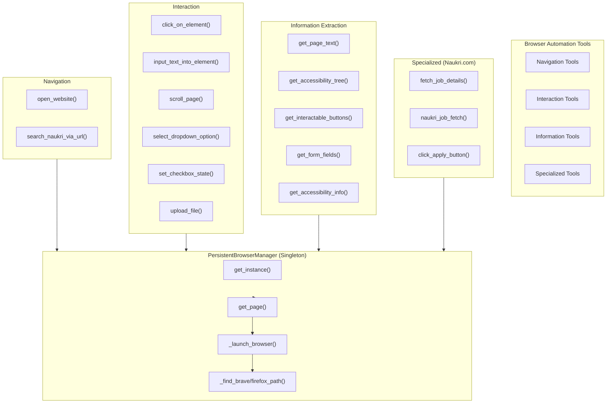
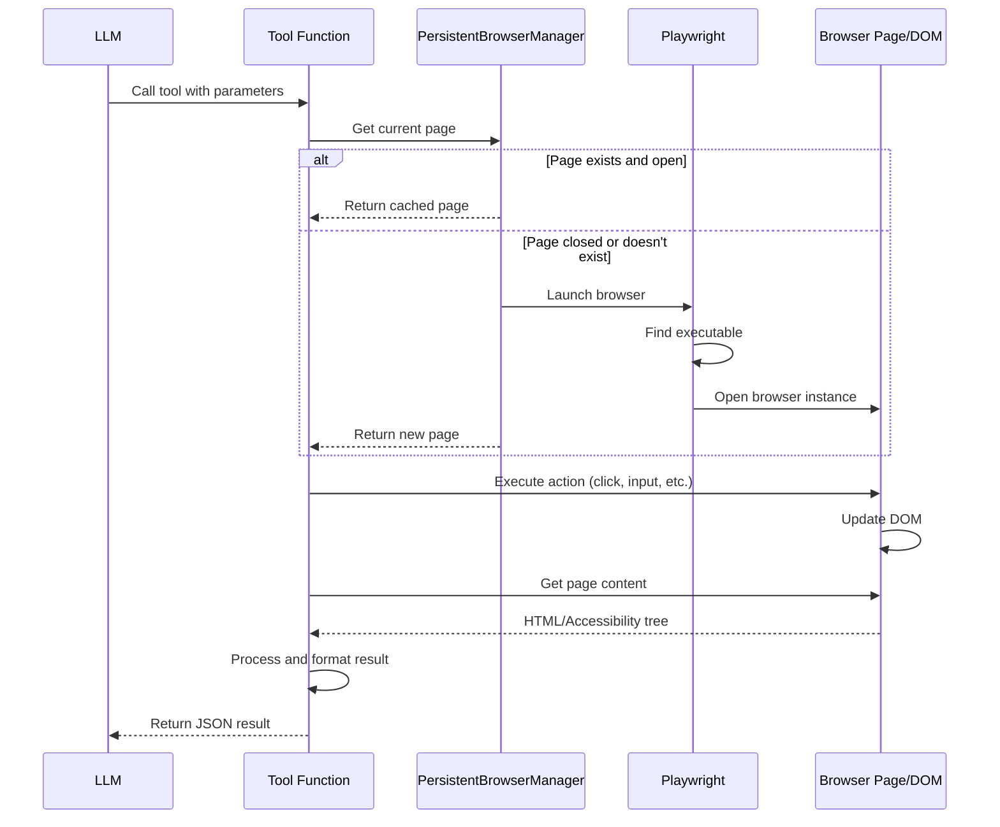
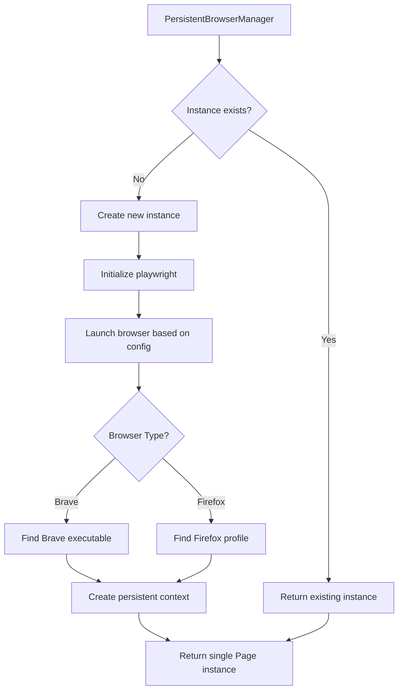
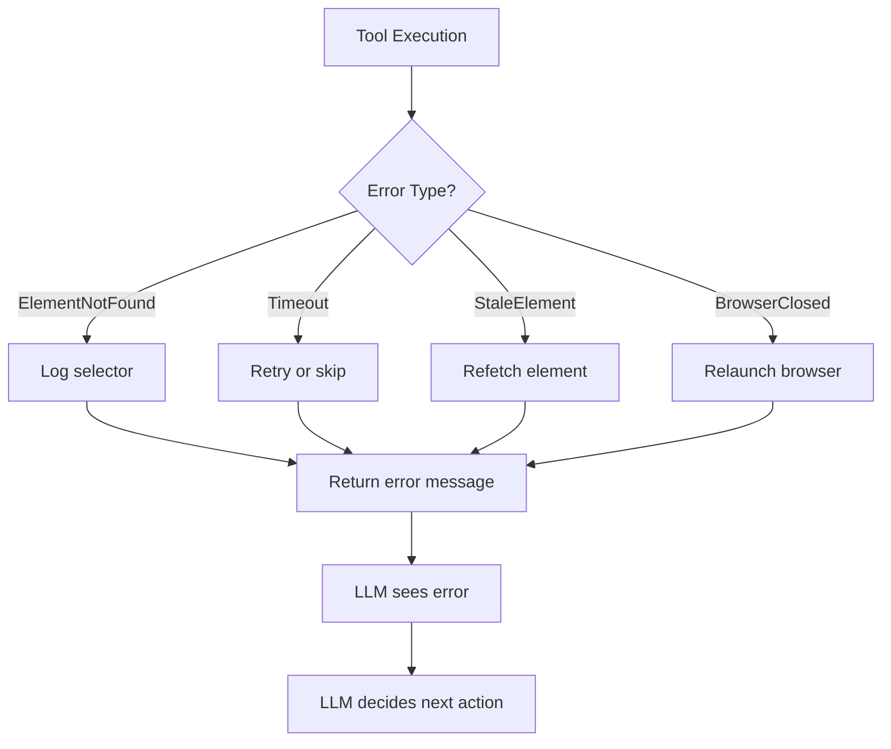

# browser_tools.py - Browser Automation Tools

## Overview

`browser_tools.py` is the core module containing all browser automation tools and the `PersistentBrowserManager` class. It provides 14+ LangChain-compatible tools for controlling web browsers and extracting information from web pages.

## Component Flow Diagram



## Tool Call Flow Diagram



## Tool Categories

### 1. Navigation Tools
- **`open_website(url, mode)`**: Opens a URL in the browser
  - Parameters: URL, mode (interactive/accessible)
  - Returns: Page title and URL confirmation

- **`search_naukri_via_url(job_title)`**: Performs Naukri.com search
  - Parameters: Job title to search for
  - Returns: Naukri.com search results page

### 2. Interaction Tools
- **`click_on_element(selector, mode)`**: Clicks an element by CSS selector
- **`input_text_into_element(selector, text, mode)`**: Types text into an input field
- **`scroll_page(direction, mode)`**: Scrolls page up/down
- **`select_dropdown_option(selector, option_value_or_text, mode)`**: Selects dropdown option
- **`set_checkbox_state(selector, checked, mode)`**: Checks/unchecks checkboxes
- **`upload_file(selector, file_path, mode)`**: Uploads files via file input

### 3. Information Extraction Tools
- **`get_page_text()`**: Returns full page text (truncated to 3000 chars)
- **`get_accessibility_tree(mode)`**: Returns accessibility tree in JSON format
- **`get_interactable_buttons()`**: Lists all clickable elements
- **`get_form_fields()`**: Extracts form fields and their types
- **`get_accessibility_info(mode)`**: Returns accessibility info (text vs interactive)

### 4. Specialized Tools
- **`fetch_job_details()`**: General purpose page text extraction
- **`naukri_job_fetch()`**: Specialized extractor for Naukri job listings
  - Targets `.srp-jobtuple-wrapper` cards
  - Extracts job title, company, salary, etc.
  - Returns structured JSON

- **`click_apply_button(mode)`**: Automatically finds and clicks "Apply" buttons
  - Handles tab switching
  - Works with multiple button variations

### 5. Utility Tools
- **`close_browser_session()`**: Closes browser (rarely used)
- **`generate_fill_values(fields_json)`**: Generates placeholder values for form fields

## PersistentBrowserManager - Singleton Pattern



## Key Features

### 1. **Persistent Context**
- Browser instance is created once and reused
- Maintains cookies, session storage, and history
- Reduces startup overhead

### 2. **Accessibility Tree Optimization**
```
Full DOM
    ↓
Prune (interactive elements only)
    ↓
Convert to JSON
    ↓
Truncate (3000 chars)
    ↓
Return to LLM
```

### 3. **Multiple Selection Modes**
- **Interactive**: Only clickable/focusable elements
- **Accessible**: Full accessibility tree with ARIA roles

### 4. **Smart Text Cleaning**
- Removes extra whitespace
- Removes script/style tags
- Preserves important structure

### 5. **Naukri-Specific Optimization**
```
Naukri Job Page
    ↓
Find all .srp-jobtuple-wrapper elements
    ↓
Extract structured data:
  - Job Title
  - Company Name
  - Salary Range
  - Location
  - Job ID
    ↓
Return as JSON array
```

## Code Organization

```
browser_tools.py
├── Imports & Logging Setup
├── PersistentBrowserManager Class
│   ├── __init__()
│   ├── get_instance() [Singleton]
│   ├── _find_brave_path()
│   ├── _find_firefox_path()
│   ├── _get_brave_user_data_dir()
│   ├── _find_firefox_profile_path()
│   ├── _copy_firefox_profile()
│   └── get_page()
├── Utility Functions
│   ├── clean_page_text()
│   ├── get_accessibility_snapshot_sync()
│   ├── prune_accessibility_tree()
│   └── get_accessibility_info()
└── LangChain Tool Definitions
    ├── Navigation (2 tools)
    ├── Interaction (6 tools)
    ├── Information (5 tools)
    └── Specialized (3 tools)
```

## Error Handling



## Performance Characteristics

| Operation | Time | Token Cost |
|-----------|------|------------|
| open_website() | 2-5s | 100-200 |
| get_page_text() | <1s | 200-500 |
| get_accessibility_tree() | <1s | 50-150 |
| click_on_element() | 1-3s | 50-100 |
| get_interactable_buttons() | <1s | 100-300 |
| naukri_job_fetch() | 2-5s | 200-400 |

## Browser Compatibility

| Browser | Status | Notes |
|---------|--------|-------|
| Brave | ✅ Preferred | Native executable, persistent context |
| Firefox | ✅ Supported | Profile copying required |
| Chromium | ✅ Fallback | Default Playwright bundled version |

## Reasoning Behind Design

1. **Singleton Pattern**: Avoid resource waste from multiple browser instances
2. **Accessibility Tree**: ~80% token reduction vs. full DOM
3. **Lazy Initialization**: Browser only launches when first tool is called
4. **Specialized Tools**: Domain-specific optimizations for job sites
5. **Persistent Context**: Maintains auth state across multiple operations
6. **Error Resilience**: Graceful fallbacks for missing browsers
