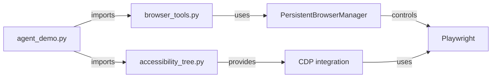

# Quick Reference Guide

## File Dependencies



## Tool Quick Reference

### Navigation
```python
open_website(url: str, mode: str = "interactive") -> str
# Opens URL, returns title and confirmation

search_naukri_via_url(job_title: str) -> str
# Searches Naukri.com for job title
```

### Information Extraction
```python
get_page_text() -> str
# Returns page text (max 3000 chars)

get_accessibility_tree(mode: str = "interactive") -> str
# Returns interactive elements as JSON tree

get_form_fields() -> str
# Returns all form fields with types

get_interactable_buttons() -> str
# Returns all clickable elements
```

### User Interaction
```python
click_on_element(selector: str, mode: str = "interactive") -> str
# Clicks element by CSS selector

input_text_into_element(selector: str, text: str, mode: str = "interactive") -> str
# Types text into input element

scroll_page(direction: str, mode: str = "interactive") -> str
# Scrolls page (direction: "up" or "down")

select_dropdown_option(selector: str, option_value_or_text: str, mode: str = "interactive") -> str
# Selects dropdown option

set_checkbox_state(selector: str, checked: bool, mode: str = "interactive") -> str
# Checks/unchecks checkbox

upload_file(selector: str, file_path: str, mode: str = "interactive") -> str
# Uploads file to file input
```

### Specialized (Naukri.com)
```python
naukri_job_fetch() -> str
# Extracts job listings from Naukri search page

fetch_job_details() -> str
# Extracts job details from current page

click_apply_button(mode: str = "interactive") -> str
# Auto-finds and clicks "Apply" button
```

## Common Task Patterns

### Pattern 1: Navigate and Extract
```
Tool 1: open_website("https://example.com")
Tool 2: get_page_text()
Result: Page content for analysis
```

### Pattern 2: Find and Click
```
Tool 1: get_interactable_buttons()
Tool 2: click_on_element("selector_from_previous_result")
Result: Element clicked
```

### Pattern 3: Fill Form
```
Tool 1: get_form_fields()
Tool 2: input_text_into_element("email_field", "user@example.com")
Tool 3: select_dropdown_option("country_dropdown", "USA")
Tool 4: click_on_element("submit_button")
Result: Form submitted
```

### Pattern 4: Extract Job Data
```
Tool 1: search_naukri_via_url("Python Developer")
Tool 2: naukri_job_fetch()
Tool 3: get_page_text() [if need more details]
Result: Structured job listings
```

## Token Cost Examples

```
Task: Search and extract 10 job listings

Expensive Approach (1500 tokens):
1. get_page_text()           [500 tokens]
2. click_on_element()        [50 tokens]
3. get_page_text()           [500 tokens]
4. scroll_page()             [50 tokens]
5. get_page_text()           [400 tokens]

Efficient Approach (300 tokens):
1. search_naukri_via_url()   [100 tokens]
2. naukri_job_fetch()        [200 tokens]

Savings: 80% reduction
```

## Mode Parameter Explained

```
mode = "interactive"  (Default, Recommended)
├── Only clickable/focusable elements
├── Faster response
├── Lower token usage
└── Perfect for automation

mode = "accessible"   (Advanced)
├── Full accessibility tree
├── More information
├── Higher token usage
└── Use when need comprehensive page analysis
```

## Environment Variable Checklist

```bash
# REQUIRED (one of these)
export GEMINI_API_KEY=...  or  export GOOGLE_API_KEY=...
export DEEPSEEK_API_KEY=...

# RECOMMENDED
export LLM_PROVIDER=deepseek  # or "google"
export BROWSER_TYPE=brave

# OPTIONAL
export BROWSER_HEADLESS=true
export BROWSER_INCOGNITO=false
export USE_PERSISTENT_CONTEXT=true
```

## Debugging Checklist

- [ ] API keys set correctly
- [ ] Browser installed (Brave or Firefox)
- [ ] All Brave instances closed (if using persistent context)
- [ ] Network connectivity verified
- [ ] At least one API provider configured
- [ ] Python dependencies installed

## Common Error Solutions

| Error | Solution |
|-------|----------|
| `FileNotFoundError: Chrome/Brave not found` | Install Brave or set `BROWSER_TYPE=firefox` |
| `API Rate Limit (429)` | Agent auto-retries; normal behavior |
| `Browser Timeout` | Close all Brave/Chrome instances; increase wait time |
| `ElementNotFoundError` | Use `get_accessibility_tree()` first to verify selector |
| `Stale Element` | Element changed; refetch with `get_accessibility_tree()` |
| `High Token Usage` | Use specialized tools (e.g., `naukri_job_fetch()`) |

## Performance Optimization Tips

1. **Use specialized tools first**
   - `naukri_job_fetch()` instead of `get_page_text()` on job pages
   - Saves 50-70% tokens

2. **Request only what you need**
   - Use `get_interactable_buttons()` instead of `get_page_text()`
   - Use `get_form_fields()` instead of full page

3. **Batch operations**
   - Perform multiple clicks/fills before fetching text again
   - Reduce round-trip overhead

4. **Reuse persistent context**
   - Keep browser open across multiple tasks
   - Preserve cookies and session state

5. **Cache results in memory**
   - Store page state for re-use
   - Avoid refetching same information

## Token Usage Per Operation

```
LLM Invocation:     100-500 tokens (depends on conversation length)
Tool Input:         10-50 tokens (tool parameters)
Tool Output:        50-1000 tokens (depends on tool)

Breakdown by tool:
- get_page_text:    200-500 tokens
- get_accessibility_tree: 50-150 tokens
- get_form_fields:  100-300 tokens
- click_on_element: 50-100 tokens
- naukri_job_fetch: 200-400 tokens
```

## Example: Complete Workflow

```python
from agent_demo import run_browser_agent

# Simple task
run_browser_agent("Open Gmail and show inbox")

# Complex task with steps
run_browser_agent("""
1. Go to Naukri.com
2. Search for 'Python Developer' jobs
3. Filter by salary >= 15 LPA
4. Extract top 5 job titles and companies
5. Report back
""")
```

## File Structure Reference

```
browser_agent/
├── browser_tools.py (1200+ lines)
│   ├── PersistentBrowserManager class
│   ├── Helper functions (clean_page_text, etc.)
│   └── Tool definitions (@tool decorator)
│
├── accessibility_tree.py (500+ lines)
│   ├── Logging setup
│   ├── Browser launch helpers
│   ├── CDP integration
│   └── Pydantic models
│
├── agent_demo.py (300+ lines)
│   ├── invoke_model_with_retry
│   └── run_browser_agent (main function)
│
└── code_explanation/ (documentation)
    ├── README.md
    ├── ARCHITECTURE.md
    ├── BROWSER_TOOLS.md
    ├── ACCESSIBILITY_TREE.md
    ├── AGENT_DEMO.md
    └── QUICK_REFERENCE.md (this file)
```

## Key Metrics to Monitor

1. **Token Usage Per Step**
   - Target: < 500 tokens
   - Alert if: > 1000 tokens

2. **Tool Execution Time**
   - Target: < 3 seconds
   - Alert if: > 10 seconds

3. **API Success Rate**
   - Target: > 95%
   - Transient failures OK (agent retries)

4. **Agent Steps to Completion**
   - Target: < 5 steps
   - Alert if: > 10 steps (hitting limit)

## Extending the Agent

### Add Custom Tool
```python
from langchain_core.tools import tool

@tool
def my_custom_tool(param1: str) -> str:
    """
    Custom tool description
    """
    # Implementation
    return result

# In agent_demo.py, add to tools list:
tools = [
    # ... existing tools
    my_custom_tool
]
```

### Add Custom Browser Action
```python
# In browser_tools.py
def my_custom_action(selector: str) -> str:
    """Custom browser action"""
    manager = PersistentBrowserManager.get_instance()
    page = manager.get_page()
    # Implementation using playwright page object
    return result

# Wrap as LangChain tool
my_action_tool = tool(my_custom_action)
```

## Testing Tools

```python
# Test tool directly
from browser_tools import open_website
result = open_website("https://example.com")
print(result)

# Test agent
from agent_demo import run_browser_agent
result = run_browser_agent("Open example.com and report page title")
print(result)

# Monitor tokens
# Agent prints token usage after each step
```

---

**Pro Tips:**
- 🔹 Always start with `open_website()` to ensure correct page
- 🔹 Use `get_accessibility_tree()` before clicking to verify elements exist
- 🔹 Check token costs for long workflows
- 🔹 Set `BROWSER_HEADLESS=false` for debugging
- 🔹 Use specialized tools for domain-specific sites
- 🔹 Persistent context saves time on repeated visits

**Remember:** The agent is autonomous but not infallible. Complex tasks may need human guidance.
