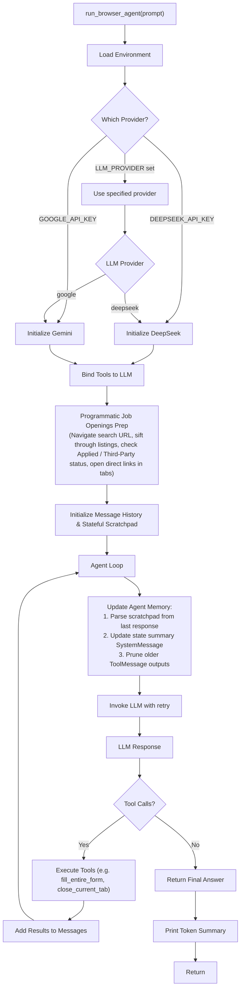
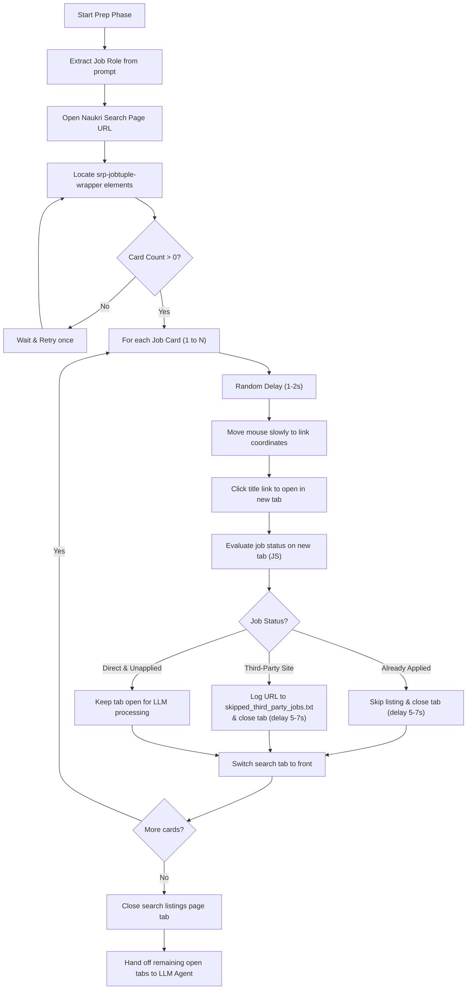
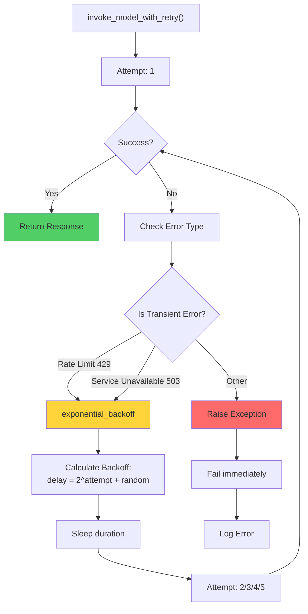
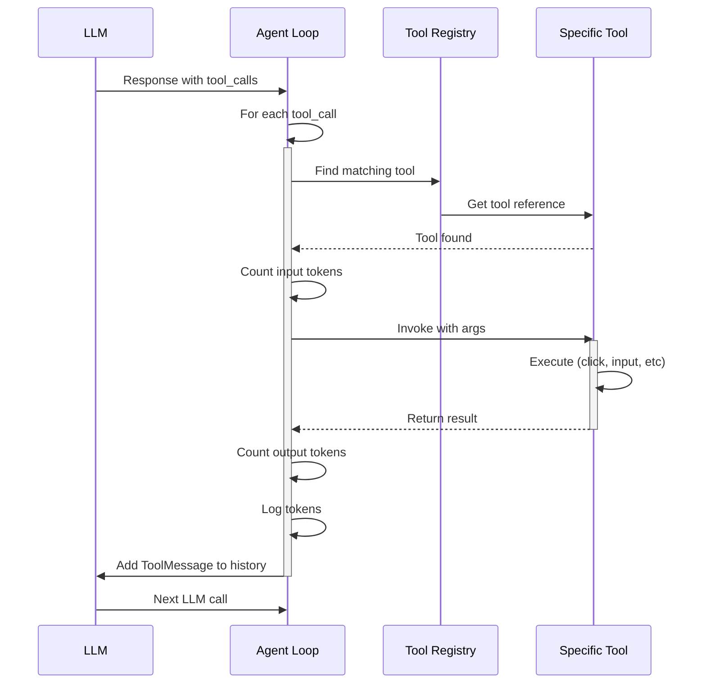
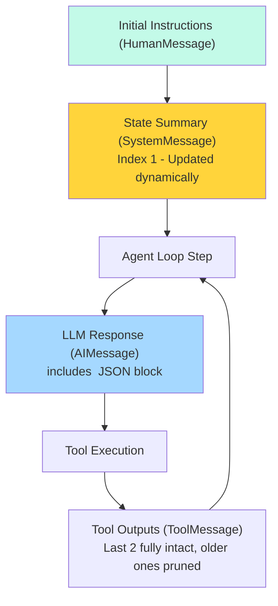
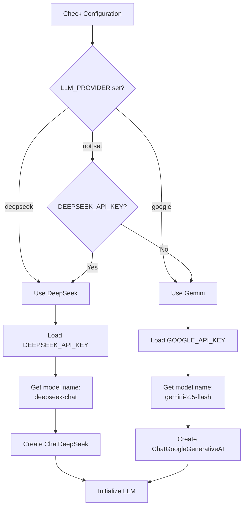
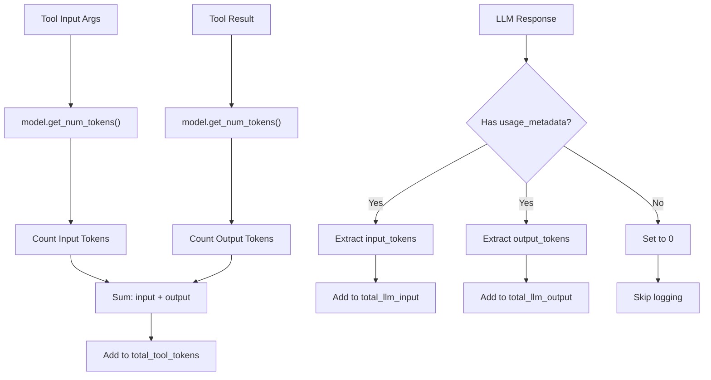
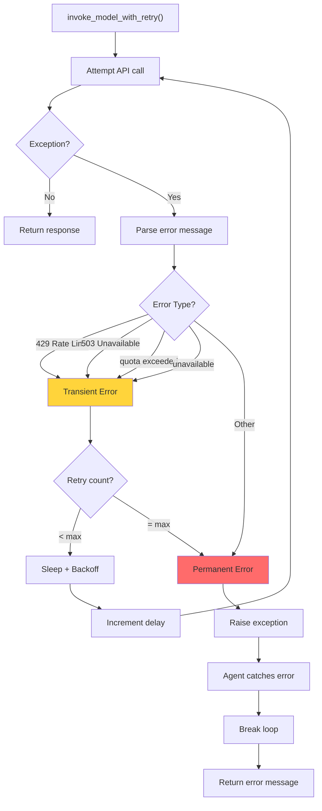
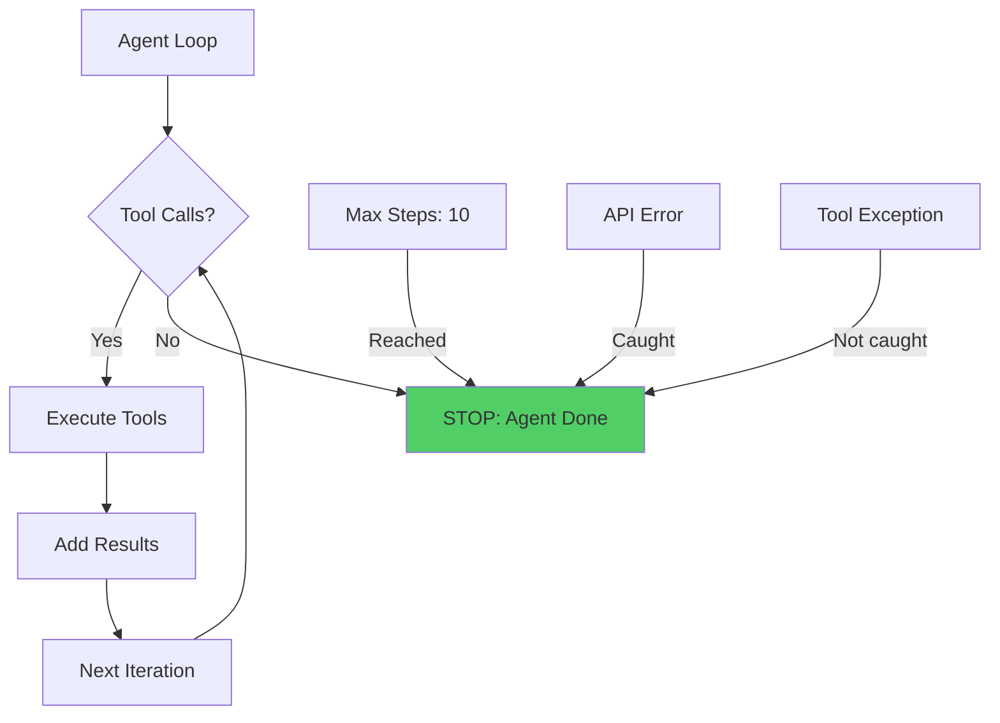

# Agent Execution Loops (naukri_agent_demo.py / indeed_agent_demo.py)

## Overview

The browser agent scripts (`naukri_agent_demo.py` and `indeed_agent_demo.py`) implement the main agent execution loop. They orchestrate interaction between LLMs (Gemini/DeepSeek) and browser automation tools, incorporating:
1. **Programmatic Pre-filtering & Tab Preparation** (to minimize LLM navigation work).
2. **Stateful Scratchpad Memory** (to maintain compact structured state).
3. **Tool Output Pruning** (to prevent message context bloat).
4. **Retry Strategies** (to handle transient API failures).

## High-Level Agent Flow



## Programmatic Pre-Filtering Flow (Naukri)



## Retry Logic Flow



## Tool Execution Loop



## Token Tracking Architecture

```mermaid
graph TB
    subgraph Tracking["Token Tracking"]
        LLMTokens["LLM Tokens"]
        ToolTokens["Tool Tokens"]
        TotalTokens["Total Tokens"]
    end
    
    subgraph Logging["Logging]
        LLMLog["LLM Token Log"]
        ToolLog["Tool Token Log"]
    end
    
    subgraph Reporting["Summary Report"]
        Report["Total Tokens Consumed"]
        Breakdown["Cost Breakdown by Component"]
    end
    
    LLMTokens --> |input + output| LLMLog
    ToolTokens --> |input + output| ToolLog
    LLMLog --> TotalTokens
    ToolLog --> TotalTokens
    TotalTokens --> Report
    LLMLog --> Breakdown
    ToolLog --> Breakdown
```

## Message History Structure



## LLM Provider Configuration



## Code Structure

```
naukri_agent_demo.py / indeed_agent_demo.py
├── Imports (SystemMessage, update_agent_memory)
├── invoke_model_with_retry()
│   ├── Loop: max_retries times
│   ├── Try: Call model.invoke()
│   ├── Catch: Check error type
│   ├── If transient: exponential backoff
│   └── Return response or raise
├── run_browser_agent(prompt)
│   ├── Load .env
│   ├── Determine LLM provider
│   ├── Initialize LLM
│   ├── Bind tools to LLM
│   ├── Initialize state_summary & message history
│   ├── Agent loop (max 35 steps)
│   │   ├── Update Agent Memory (prunes old tool outputs & updates state summary)
│   │   ├── Invoke LLM with retry
│   │   ├── Log LLM tokens
│   │   ├── Check for tool calls
│   │   └── For each tool call:
│   │       ├── Count tokens & execute tool
│   │       └── Add tool results to messages
│   └── Print final answer & token summary
```

## Token Counting Strategy



## Error Handling Flow



## Tool Binding and Calling

```python
# Tool binding creates callable versions
model_with_tools = model.bind_tools(tools)

# When LLM calls a tool, it returns:
response.tool_calls = [
    {
        "name": "tool_name",      # str
        "args": {...},            # dict
        "id": "call_123"          # str (for async tracking)
    },
    ...
]

# We then:
# 1. Find matching tool by name
# 2. Call tool.invoke(args)
# 3. Get result as string
# 4. Create ToolMessage with result and call id
# 5. Add to message history
# 6. LLM sees result and decides next action
```

## Agent Loop Termination Conditions



## Step-by-Step Execution Example

```
Step 1: LLM Input
  Task: "Search for Python jobs on Naukri"
  Tools: [open_website, search_naukri, get_page_text, ...]

Step 2: LLM Output
  Thought: "I need to search for Python jobs. Let me use search_naukri_via_url"
  Tool Call: search_naukri_via_url("Python Developer")

Step 3: Tool Execution
  Tool: search_naukri_via_url
  Input: {"job_title": "Python Developer"}
  Result: "Naukri search page loaded with 5000+ results"

Step 4: LLM Receives Result
  Sees: Tool result added to message history
  Thought: "Great! Now let me get the job details from the search results"
  Tool Call: naukri_job_fetch()

Step 5: Tool Execution
  Tool: naukri_job_fetch
  Result: JSON array of 10 job listings with title, company, salary

Step 6: LLM Receives Data
  Thought: "I have the job information. Let me provide final answer"
  No more tool calls

Step 7: Final Answer
  Returns complete list with formatting to user
```

## Reasoning Behind Design Choices

1. **Exponential Backoff**: Respects API rate limits, increases wait time each attempt.
2. **Token Tracking**: Monitors cost per tool and per LLM call for optimization.
3. **Stateful Scratchpad**: Replaces verbose message history with a single dynamically updated SystemMessage tracking goals, data, and steps.
4. **Tool Output Pruning**: Keeps only the last 2 steps of tool results intact, avoiding context limits and reducing token costs.
5. **Step Limit**: Set at a generous max 35 steps to allow thorough workflows.
6. **Tool Binding**: Leverages LangChain's built-in tool calling mechanism.
7. **Error Isolation**: Tool errors don't crash the agent; the LLM sees the error message and adapts.
8. **Provider Flexibility**: Supports multiple LLM providers (Gemini, DeepSeek).

## Token Efficiency Tips

1. **Memory Pruning**: Automatically prunes older, massive tool outputs (like DOM accessibility trees) to keep context tokens minimal.
2. **Stateful Scratchpad**: Restores context summary without needing the model to re-analyze historical turns.
3. **Early Tool Specialization**: Use `naukri_job_fetch()` instead of `get_page_text()` for job listings.
4. **Accessibility Mode**: Employs structural accessibility trees for 80%+ reduction in page data size.
5. **Batch Operations**: Uses `fill_entire_form` to fill forms in one call instead of field-by-field.

## Integration Points

- **LangChain**: `BaseTool`, `HumanMessage`, `AIMessage`, `ToolMessage`
- **LLM APIs**: Gemini, DeepSeek (via LangChain integration)
- **Browser**: All tools from `browser_tools.py`
- **Accessibility**: Uses tools defined in `accessibility_tree.py`
- **Configuration**: Reads from `.env` file
