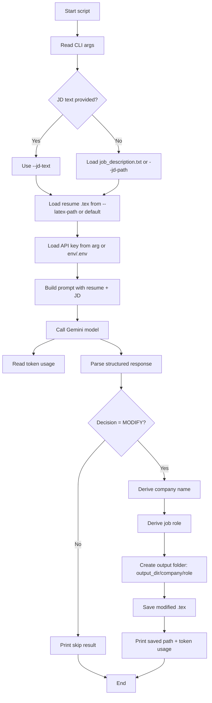

```mermaid
flowchart TD
    A[Start script] --> B[Read CLI args]
    B --> C{JD text provided?}
    C -- Yes --> D[Use --jd-text]
    C -- No --> E[Load job_description.txt or --jd-path]
    D --> F[Load resume .tex from --latex-path or default]
    E --> F
    F --> G[Load API key from arg or env/.env]
    G --> H[Build prompt with resume + JD]
    H --> I[Call Gemini model]
    I --> J[Read token usage]
    I --> K[Parse structured response]
    K --> L{Decision = MODIFY?}
    L -- No --> M[Print skip result]
    L -- Yes --> N[Derive company name]
    N --> O[Derive job role]
    O --> P[Create output folder: output_dir/company/role]
    P --> Q[Save modified .tex]
    Q --> R[Print saved path + token usage]
    M --> S[End]
    R --> S[End]
```